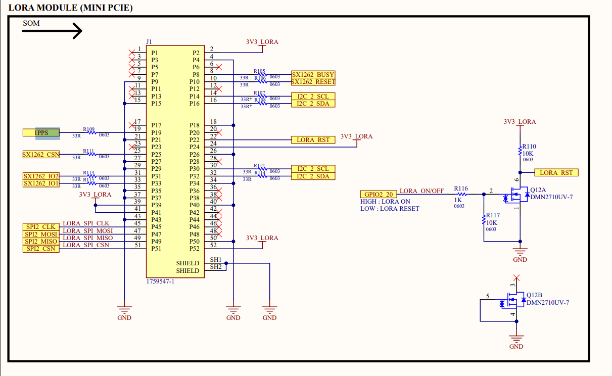
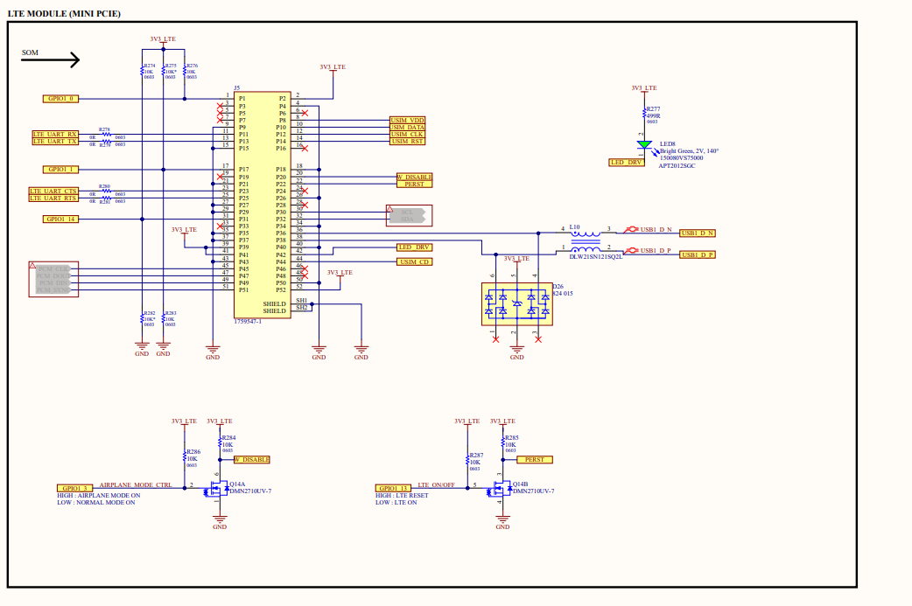

# Compute Module LTE Gateway Board

> **Hazırlayan:** Oğuzhan ESEN  
> **Proje Adı:** Compute Module LTE Gateway Board  
> **Tarih:** 25 Ocak 2026  
> **Versiyon:** v1.0 
---

## İçindekiler

---

## Litaratür Araştırması
### Lora Gateway module 

https://files.seeedstudio.com/products/113100022/WM1302%20Pi%20Hat%20v1.0.pdf 
https://wiki.seeedstudio.com/WM1302_Pi_HAT/ 
https://wiki.seeedstudio.com/WM1302_module/ 

### LTE Module
 
[text](c:/Users/oesen/Downloads/quectel_eg25-g_mini_pcie_hardware_design_v1-3.pdf)
https://www.quectel.com/product/lte-eg25-g-mpcie/ 

### Power 
- TPS5450

### Ethernet Switch

Switch entegresi olarak, kaynaknağının yaygın olması ve uygulamarda sıklıkla kullanılması sebebiyle RTL8367RB ve RTL8367N modelleri arasında kalınmıştır. paket ve pin yapısının daha kuçuk olması sebebiyle RTL8367N modeli kullanılması uygun görülmüştür.

https://easyeda.com/editor#id=a41998c66c7646a19f639278ddf929c6

https://file.elecfans.com/web2/M00/72/DB/pYYBAGNUvAKAOjMXABIoLdzifOI547.pdf

https://github.com/geerlingguy/raspberry-pi-pcie-devices/issues/354 

https://en.eeworld.com.cn/Reference_Designs/detail/58509 

https://lceda.cn/editor#id=991180970484467498828ca62de564fe

https://rdesigns.eeworld.com.cn/huodong/yunpan/szlcsc/5615/276f496c-a1ec-11ee-9c86-080027cf0034.pdf 

https://rdesigns.eeworld.com.cn/huodong/yunpan/szlcsc/6645/0eff261c-3c2e-11ed-b549-086126841eb8.pdf

file:///C:/Users/oesen/AppData/Local/Temp/f9053e67-9b6d-42ea-84ff-4806e7fd421e_5df16080-5d0c-11ed-8b1f-086126841eb8.zip.21e/SCH_Schematic1_2022-11-05.pdf 

https://www.willwhang.dev/Miniature-CM4-Cluster/ 

https://github.com/will127534/Miniature-CM4-Cluster 

## 1. Giriş

---

## 2. Tasarımın Amacı ve Kapsamı

---
## 3. Sistem Blok Diyagramı

---

## 4. Şematik ve PCB

---

## 5. Test Notları

---

## 6. Geliştirme ve İyileştirme Önerileri

